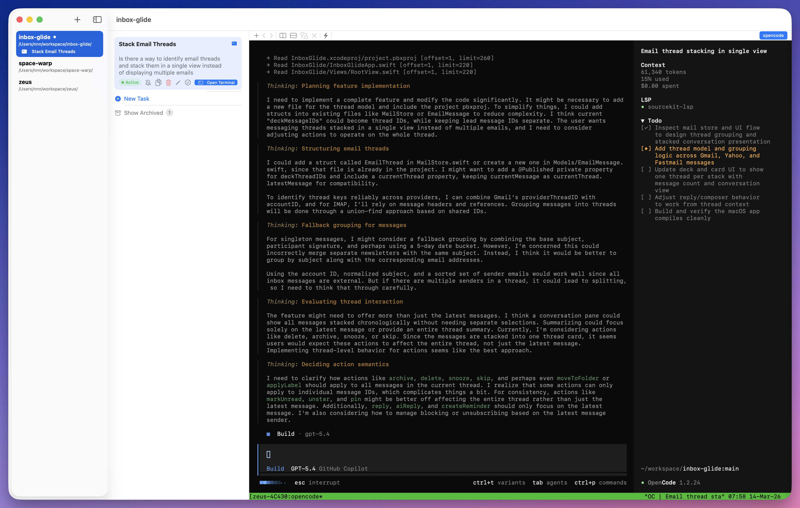

# Open-Zeus

Native macOS AI agent orchestrator. Visual control plane for managing fleets of AI agents.



## Features

- **Three-column layout** — Projects, Tasks, and Terminal side by side
- **Persistent terminal sessions** — tmux-backed sessions survive app restarts; attach to a running agent anytime
- **Multi-window terminals** — open, close, split (horizontal/vertical), and rotate panes per task
- **Watch mode** — get a macOS notification and/or sound alert when an agent goes idle
- **Quick commands** — save and one-click-run shell commands per project
- **Task archiving** — hide completed tasks without losing their terminal history

## Install

```bash
./install.command
```

Builds a release binary, creates `OpenZeus.app`, installs it to `~/Applications`, and launches it. Requires Xcode Command Line Tools (`xcode-select --install`).

## Development

```bash
swift build       # debug build
swift run OpenZeus
swift test
./scripts/lint.sh
./scripts/check.sh
./scripts/install-hooks.sh
```

`./scripts/install-hooks.sh` configures Git to use the repo's pre-commit hook. Each commit then runs SwiftLint and `swift test` before Git creates the commit.

## Requirements

- macOS 15+
- Swift 6+
- tmux (recommended — `brew install tmux`)
- SwiftLint (`brew install swiftlint`)

## License

MIT
