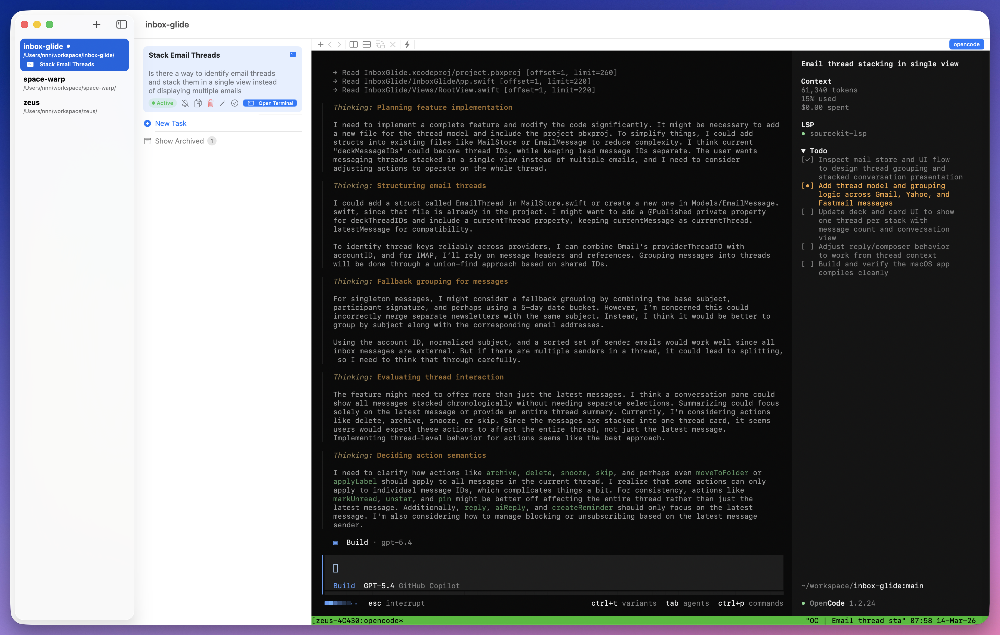

# Open-Zeus

Native macOS AI agent orchestrator. Visual control plane for managing fleets of AI agents.



📸 See the **[Product Tour](product-tour/PRODUCT_TOUR.md)** for a visual walkthrough of every feature — with annotated screenshots.

## Features

### Terminal

- **Persistent sessions** — tmux-backed sessions survive app restarts; attach to a running agent anytime
- **Multi-window management** — open, close, split (horizontal/vertical), rotate, and zoom panes per task
- **Process detection** — live badges show when an agent is running vs idle, with child-process tree traversal
- **Scroll & mouse mode** — trackpad and mouse-wheel scrolling flows through tmux mouse mode (copy-mode scrolling with pane-under-pointer targeting), auto-copy on selection drag
- **Configurable font** — set font family, size, and weight in Settings
- **Shift+Enter support** — kitty keyboard protocol for apps like Claude Code
- **Orphan cleanup** — periodic scan kills tmux sessions whose tasks no longer exist
- **Per-pane transcripts** — retained, plain-text transcripts for every tmux-backed task pane; ANSI styling and terminal control codes are removed

### Git Integration

- **Live status bar** — branch, staged/unstaged/untracked counts, ahead/behind badges
- **Inline diff view** — color-coded per-file diffs with added/removed/hunk highlighting
- **Unpushed commits** — view files in unpushed commits with per-file revert
- **Quick actions** — unstage, discard, delete untracked, or revert all changes
- **Auto-refresh** — file-system watching on index/HEAD with configurable polling for remote

### Git Worktrees

- **Automatic creation** — optionally create a worktree per task with auto-generated branch names
- **Active-pane creation** — create a UUID-named worktree from a task terminal’s active pane and switch that pane into it
- **Cleanup scanner** — settings tab finds orphaned worktree directories, stale references, and archived-task worktrees
- **Branch badges** — tasks with worktrees display their branch name

### Projects & Tasks

- **Search/filter** — searchable project sidebar with name and path matching
- **Task archiving** — hide completed tasks; optionally kill tmux session and remove worktree on archive
- **Context menus** — Open in Finder, Open in Terminal, Delete
- **Task editing** — edit task descriptions via inline pencil button
- **Active-pane worktrees** — the terminal’s worktree button is available for normal and Quick Tasks when tmux is available and the active pane is idle
- **Active badges** — open task count and running process indicators per project

### App Launcher

- **Per-project shortcuts** — add apps to launch with the project directory
- **Global/local scope** — promote or demote app shortcuts between project-specific and global

### Quick Commands

- **Save & run** — one-click shell commands per project or global across all projects
- **Variable expansion** — `${zeus_project_directory}` resolves to the project path
- **Terminal bar** — persistent colored command buttons in the terminal toolbar

### Keyboard Navigation

| Shortcut | Action |
|----------|--------|
| `Cmd+1` | Focus Projects panel |
| `Cmd+2` | Focus Tasks panel |
| `↑` / `↓` | Navigate project or task list |
| `Enter` | Focus terminal from task list |
| `Escape` | Close Settings window |

### Watch Mode

- **Off** — no notifications
- **On** — macOS notification + sound alert when an agent goes idle
- **Silent** — notification only, no sound

### Settings (7 Tabs)

| Tab | Configures |
|-----|------------|
| Terminal | Font, shell, tmux prefix, poll intervals, orphan cleanup |
| Notifications | Alert sound, notification title/body template |
| Git | Executable path, debounce, remote poll interval |
| Worktree | Base directory, default branch, create-by-default, cleanup |
| Interface | Sidebar widths, task sheet width, quick commands dimensions |
| Data | Database location, log rotation, timestamp format |
| LLM | Provider, base URL, model, API key env var |

Configuration is stored as JSON in `~/Library/Application Support/OpenZeus/config.json`.

Task-pane transcripts are stored in `~/Library/Application Support/OpenZeus/Transcripts/`. They are retained after panes, tasks, and projects are closed or deleted. Use **Settings → Data → Open Transcript Directory** to reveal them in Finder. Transcript capture requires tmux; full-screen applications that repeatedly redraw their display may be less linear than normal shell and agent output.

## Install

```bash
./install.command
```

Builds a release binary, creates `OpenZeus.app`, installs it to `~/Applications`, and launches it. Requires Xcode Command Line Tools (`xcode-select --install`).

## Development

```bash
swift build          # debug build
swift run OpenZeus   # run from source
swift test           # run tests
./scripts/lint.sh    # SwiftLint
./scripts/check.sh   # lint + tests
```

### Scripts

| Script | Purpose |
|--------|---------|
| `scripts/lint.sh` | Run SwiftLint |
| `scripts/check.sh` | Lint + tests combined |
| `scripts/install-hooks.sh` | Install git pre-commit hook (SwiftLint + swift test) |
| `scripts/setup-git-notes.sh` | Configure git notes sharing |
| `install.command` | Build release binary, create .app, install to ~/Applications |

`./scripts/install-hooks.sh` configures Git to use the repo's pre-commit hook. Each commit then runs SwiftLint and `swift test` before Git creates the commit.

## Requirements

- macOS 15+ (Sequoia)
- Swift 6+
- tmux (recommended — `brew install tmux`)
- SwiftLint (`brew install swiftlint`)

## Tech Stack

| Component | Technology |
|-----------|------------|
| Language | Swift 6 (strict concurrency) |
| Terminal | [SwiftTerm](https://github.com/migueldeicaza/SwiftTerm) |
| Database | [GRDB.swift](https://github.com/groue/GRDB.swift) (SQLite) |
| Build | Swift Package Manager |
| Concurrency | `async/await`, actors (`OrchestratorActor`), `@MainActor` |

## License

MIT — Copyright 2025 Namuan
