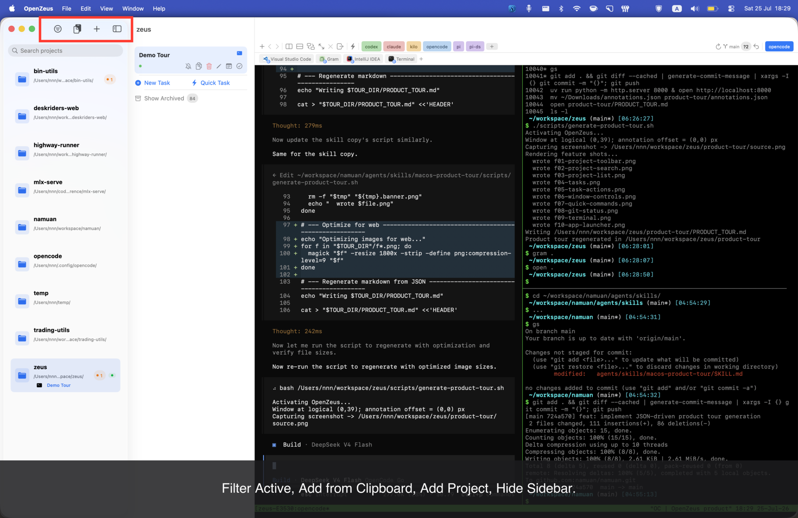
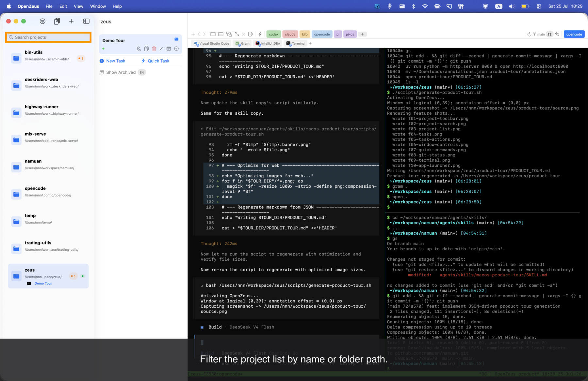
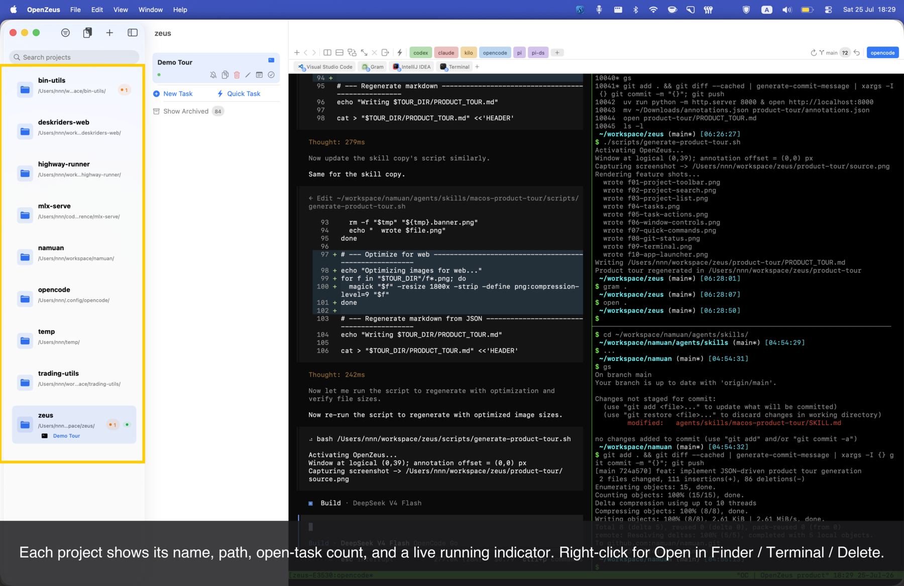
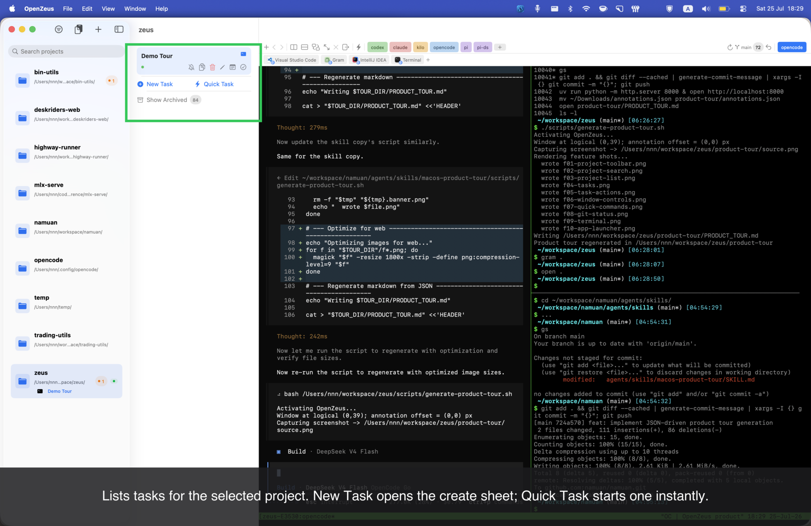
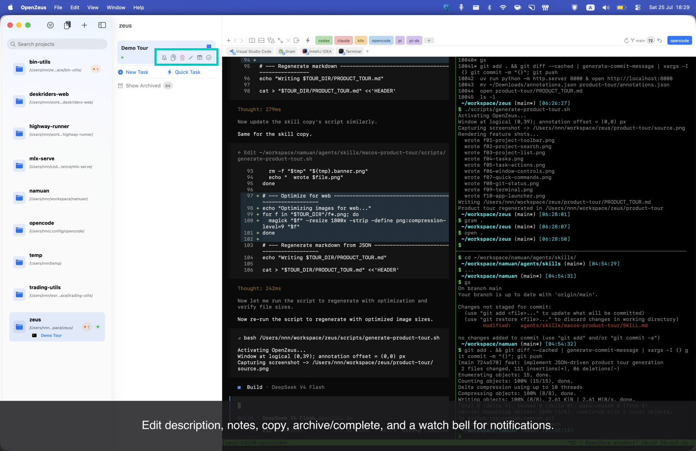
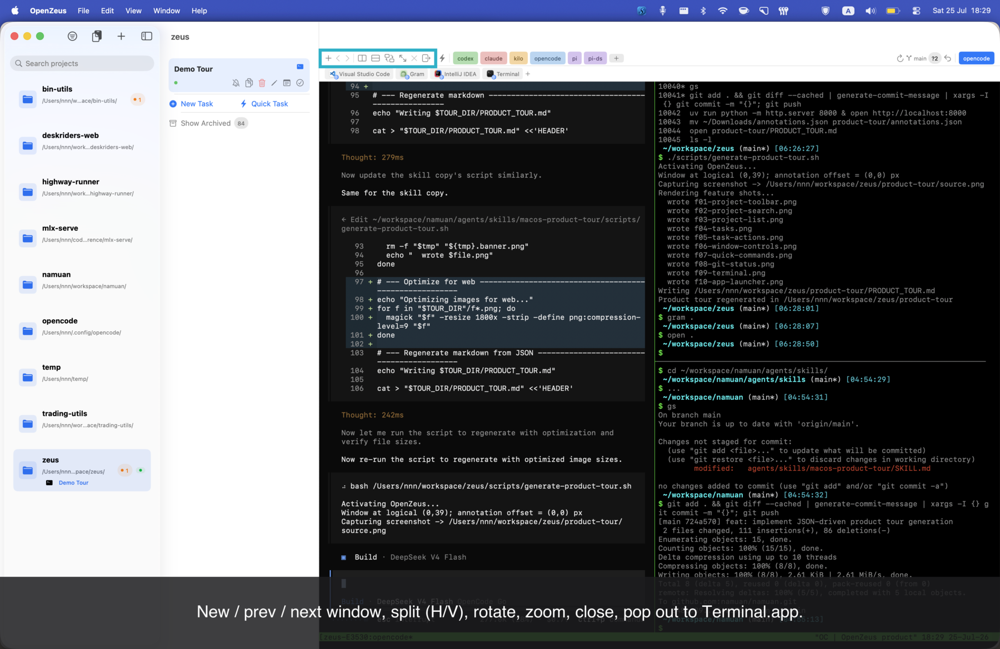
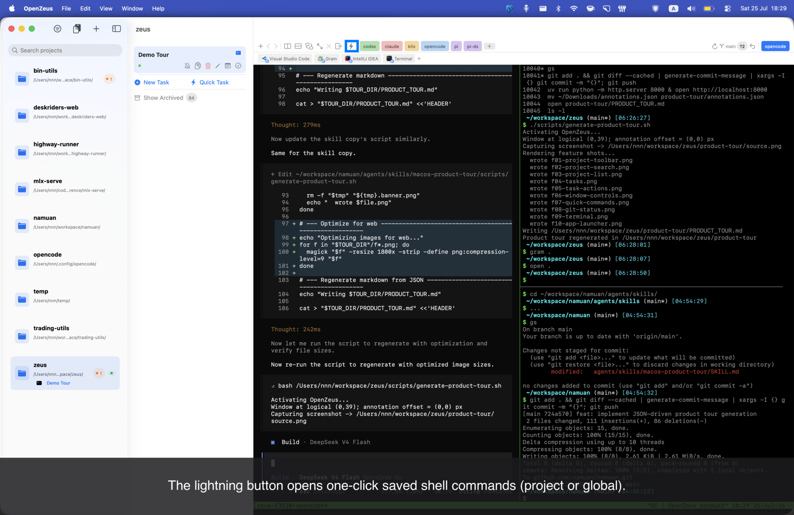
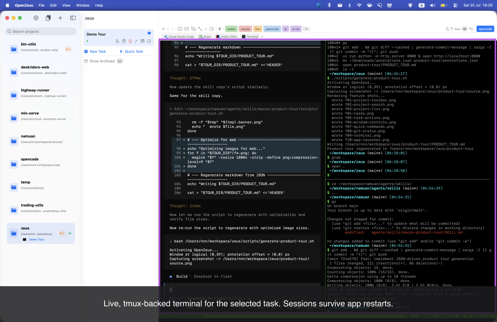
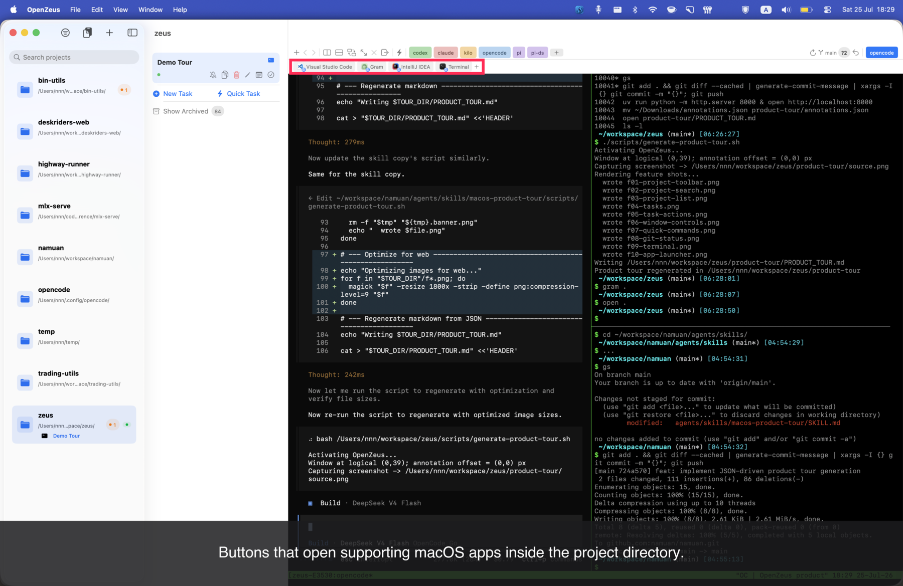

# OpenZeus — Product Tour

Each feature is shown on a full-screen shot of the running app, with a single colored outline marking the control and a large white description centered at the bottom on a tinted grey bar. No buttons were clicked or states changed — these are captures of the live window.

### Project toolbar

Filter Active, Add from Clipboard, Add Project, Hide Sidebar.

### Project search

Filter the project list by name or folder path.

### Project list

Each project shows its name, path, open-task count, and a live running indicator. Right-click for Open in Finder / Terminal / Delete.

### Tasks

Lists tasks for the selected project. New Task opens the create sheet; Quick Task starts one instantly.

### Task actions

Edit description, notes, copy, archive/complete, and a watch bell for notifications.

### Window & pane controls

New / prev / next window, split (H/V), rotate, zoom, close, pop out to Terminal.app.

### Quick Commands

The lightning button opens one-click saved shell commands (project or global).

### Git status bar

Branch, staged / unstaged / untracked counts, ahead-behind, Show changed files, Revert All.

### Terminal

Live, tmux-backed terminal for the selected task. Sessions survive app restarts.

### App launcher

Buttons that open supporting macOS apps inside the project directory.
